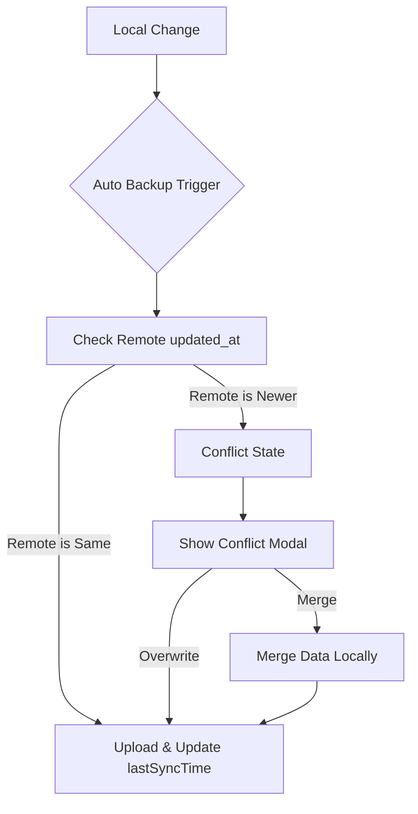

# [Design] 실시간 동기화 충돌 해결 및 데이터 병합

## 1. 시스템 아키텍처

### 1.1 데이터 흐름도

## 2. 상세 설계

### 2.1 Optimistic Locking (낙관적 잠금)
- `SupabaseContext` 내부에 `remoteUpdatedAt` 상태 관리.
- `uploadData` 호출 시 `supabaseService.fetchUserData`를 통해 최신 `updated_at` 확인.
- `lastSyncTime` (UTC epoch)와 비교하여 차이가 2초 이상이면 충돌로 간주.

### 2.2 Supabase Realtime 설정
- `SupabaseContext`의 `useEffect`에서 채널 구독.
- 테이블: `user_journal_data`
- 이벤트: `UPDATE`
- 필터: `user_id = eq.${user.id}`
- 액션: `checkRemoteVersion()` 실행

### 2.3 데이터 병합 로직 (Smart Merge)
`localStorageService.mergeAppData(local, remote)` 구현:

1. **Classes**: ID 기준으로 합집합.
2. **ClassData**:
   - **Students**: ID 기준으로 합집합. 동일 ID면 local 유지 (학생 정보는 자주 바뀌지 않음).
   - **Todos**: ID 기준으로 합집합. 동일 ID면 local 유지 (또는 완료 여부 비교).
   - **Records**: 날짜(date) 기준으로 합집합.
     - 동일 날짜 충돌 시: `classLog`의 길이를 비교하여 더 긴 쪽 선택 (단순 휴리스틱).
     - 향후 `updatedAt` 필드를 각 레코드에 추가하여 정교화 가능.

### 2.4 UI 컴포넌트
- `SyncConflictModal`:
  - 현재 로컬 데이터와 서버 데이터의 시간 차이 표시.
  - 병합 후 업로드 / 서버 데이터로 덮어쓰기 / 현재 로컬 강제 업로드 버튼.

## 3. API 및 데이터 스키마 수정
- `user_journal_data` 테이블 스키마는 기존 그대로 유지 (`user_id`, `data`, `updated_at`).
- `data` JSON 내부의 `AppData` 구조 유지.

## 4. 보안 및 예외 처리
- 모든 병합 작업은 로컬에서 복호화된 상태로 진행.
- 네트워크 오류 시 자동 백업을 즉시 중단하고 재시도 로직 대기.
